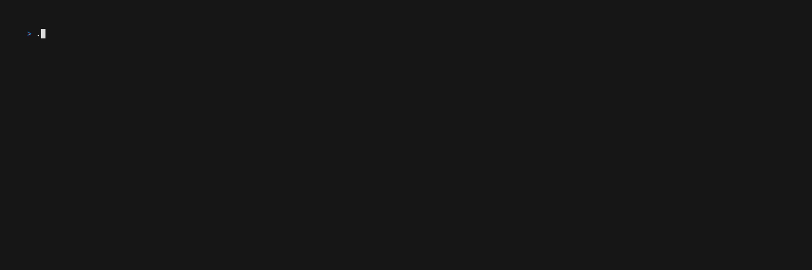

# eth-watch

A terminal dashboard for monitoring multiple Ethereum (or EVM-compatible) RPC nodes in real time.



## Features

- **Batch RPC queries** — all data for each node is fetched in a single HTTP request using JSON-RPC batch mode, minimizing latency
- **Live TUI dashboard** — built with [Bubble Tea](https://github.com/charmbracelet/bubbletea), the table refreshes automatically at a configurable interval
- **Per-column sorting** — sort by any column with `←`/`→` to select and `Space`/`Enter` to toggle direction, just like `htop`
- **Block lag indicators** — Safe and Finalized block heights show their lag behind Latest in red `(-N)`
- **Multi-node concurrency** — all nodes are queried in parallel
- **Kubernetes auto-discovery** — when running inside a K8s cluster, automatically discovers and probes services that expose Ethereum RPC ports; the header shows a `K8S` badge
- **Regex filter** — press `/` to interactively filter displayed nodes by URL using a regular expression

## Columns

| Column    | Source RPC method               | Description                                      |
|-----------|---------------------------------|--------------------------------------------------|
| URL       | —                               | RPC endpoint URL                                 |
| ChainID   | `eth_chainId`                   | Chain ID (decimal)                               |
| Latest    | `eth_getBlockByNumber("latest")`| Latest block height                              |
| Hash      | `eth_getBlockByNumber("latest")`| Latest block hash (first 4 + last 4 hex chars)   |
| Safe      | `eth_getBlockByNumber("safe")`  | Safe head height, with lag vs Latest             |
| Finalized | `eth_getBlockByNumber("finalized")` | Finalized head height, with lag vs Latest    |
| Syncing   | `eth_syncing`                   | `synced` (green) or `syncing` (yellow)           |
| Peers     | `net_peerCount`                 | Connected peer count                             |
| Version   | `web3_clientVersion`            | Client software version string                   |
| Updated   | —                               | Time since last successful query                 |

## Installation

### Pre-built binaries

Download the latest binary for your platform from the [Releases](../../releases) page.

### Build from source

```bash
git clone https://github.com/shidaxi/eth-watch.git
cd eth-watch
go build -o eth-watch .
```

Requires Go 1.21+.

## Configuration

Create a `config.yaml` file (default path: `./config.yaml`):

```yaml
# Poll interval in seconds (default: 12)
interval: 12

rpcs:
  - https://eth.drpc.org
  - https://rpc.ankr.com/eth
  - https://cloudflare-eth.com
```

| Field      | Type     | Default | Description                        |
|------------|----------|---------|------------------------------------|
| `interval` | integer  | `12`    | Seconds between each refresh cycle |
| `rpcs`     | string[] | —       | List of RPC endpoint URLs to monitor |

## Usage

```bash
# Use default config path (./config.yaml)
./eth-watch

# Specify a custom config file
./eth-watch -config /path/to/config.yaml
```

## Keyboard Controls

| Key              | Action                                      |
|------------------|---------------------------------------------|
| `←` / `h`        | Move sort column left                       |
| `→` / `l`        | Move sort column right                      |
| `Space` / `Enter`| Toggle sort direction (ascending/descending)|
| `a`              | Sort ascending                              |
| `d`              | Sort descending                             |
| `1` – `9`        | Jump to column N directly                   |
| `/`              | Enter filter mode (type regex to filter URLs)|
| `Esc`            | Exit filter mode / clear active filter      |
| `q` / `Ctrl+C`   | Quit                                        |

## Kubernetes Auto-discovery

When `eth-watch` is deployed inside a Kubernetes cluster (detected via the `KUBERNETES_SERVICE_HOST` environment variable), it automatically:

1. Lists all `Service` objects across all namespaces via the K8s API
2. Identifies candidate services whose **service name** matches `DISCOVERY_K8S_SERVICE_REGEX` **or** whose **port number** (as a string) matches `DISCOVERY_K8S_PORT_REGEX`
3. Concurrently probes each candidate with an `eth_chainId` call to verify it is a live JSON-RPC node
4. Adds confirmed live endpoints to the monitoring list

The `⎈ K8S` badge is shown in the title bar when running in this mode. Any RPCs configured via `config.yaml` or the `RPCS` environment variable are merged with the discovered ones.

### Discovery Environment Variables

| Variable | Default | Description |
|---|---|---|
| `DISCOVERY_K8S_SERVICE_REGEX` | `.*(rpc\|geth\|reth\|erigon\|besu\|nethermind).*` | Regex matched against the service name |
| `DISCOVERY_K8S_PORT_REGEX` | `.+45$` | Regex matched against the port number (e.g. `8545`, `9545`) |

A service port is included as a candidate if **either** regex matches. Example override:

```bash
DISCOVERY_K8S_SERVICE_REGEX='.*(node|chain).*' \
DISCOVERY_K8S_PORT_REGEX='^8545$' \
./eth-watch
```

### Required RBAC Permissions

`eth-watch` needs permission to list `Service` objects cluster-wide. Apply the following manifests:

```yaml
apiVersion: v1
kind: ServiceAccount
metadata:
  name: eth-watch
  namespace: default          # change to the namespace where eth-watch runs
---
apiVersion: rbac.authorization.k8s.io/v1
kind: ClusterRole
metadata:
  name: eth-watch
rules:
  - apiGroups: [""]
    resources: ["services"]
    verbs: ["get", "list"]
---
apiVersion: rbac.authorization.k8s.io/v1
kind: ClusterRoleBinding
metadata:
  name: eth-watch
roleRef:
  apiGroup: rbac.authorization.k8s.io
  kind: ClusterRole
  name: eth-watch
subjects:
  - kind: ServiceAccount
    name: eth-watch
    namespace: default        # same namespace as above
```

Reference the service account in your Pod / Deployment:

```yaml
spec:
  serviceAccountName: eth-watch
```

> **Namespace-scoped alternative** — if you only want to discover services in a single namespace, replace `ClusterRole` / `ClusterRoleBinding` with `Role` / `RoleBinding` scoped to that namespace.

## License

MIT
